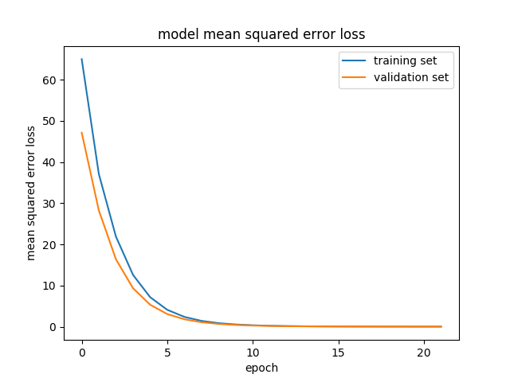

# **Behavioral Cloning**

---

**Behavioral Cloning Project**

The goals / steps of this project are the following:
* Use the simulator to collect data of good driving behavior
* Build, a convolution neural network in Keras that predicts steering angles from images
* Train and validate the model with a training and validation set
* Test that the model successfully drives around track one without leaving the road
* Summarize the results with a written report

## Rubric Points
### Here I will consider the [rubric points](https://review.udacity.com/#!/rubrics/432/view) individually and describe how I addressed each point in my implementation.  

---
### Files Submitted & Code Quality

#### 1. Submission includes all required files and can be used to run the simulator in autonomous mode

My project includes the following files:
* model.py containing the script to create and train the model
* drive.py for driving the car in autonomous mode
* model.h5 containing a trained convolution neural network
* writeup_report.md or writeup_report.pdf summarizing the results

#### 2. Submission includes functional code
Using the Udacity provided simulator and my drive.py file, the car can be driven autonomously around the track by executing
```sh
python drive.py model.h5  
```

#### 3. Submission code is usable and readable

The train.py file contains the code for training and saving the convolution neural network. The file shows the pipeline I used for training and validating the model, and it contains comments to explain how the code works.

### Model Architecture and Training Strategy

#### 1. An appropriate model architecture has been employed

My final model adopted the pretrained VGG-16. It was because I was unable to recognize the undrawn road in the examination stage. For example I implemented Nvidia's models and LeNet, but I could not solve the problem of getting out of there anyway. And I thought that the reason is that the image recognition capability is not enough (less teacher data), I decided to use the pretrained model. As a result this worked well. Detailed layer structure and training strategy are described in the below.

#### 2. Attempts to reduce overfitting in the model

In order to reduce overfitting, of course, we incorporated a dropout layer during training. However, I do not know whether this should be called overfitting, but when using learning results with a large number of epochs, the car began drawing waves. When I got out of the center position of the road, I cut the handle to a large extent, and as a result it did not converge and it began to undulate. I thought that this occurred because the sensitivity to the car staying at the center position increased due to learning and I thought that this was a type of overfitting. So, the final learning model is not the model at the moment MSE converged, but the intermediate learning model. Details about this will be described in the below.

#### 3. Model parameter tuning

The model used an adam optimizer, so the learning rate was not tuned manually (train.py line 259).

#### 4. Appropriate training data

At first, I thought about making training data myself, I did several recordings. On the other hand, I prepared data by Udacity to evaluate my own data. I learned each data set with the same model and looked at the movement of the car as a result, it turned out that Udacity's data was more stable movement. I thought that this indicates that noise or bias is applied to the dataset I created, this time I decided to use the official dataset of Udacity.

### Model Architecture and Training Strategy

#### 1. Solution Design Approach

To put it briefly, the project of this was to obtain the handle amount from the image. Therefore, first, image recognition technology is required, and we think that relatively high precision is necessary. Therefore, I have studied multiple image recognition networks (e.g. LeNet and Nvidia's etc). Also, in the image recognition area, CNN is generally used, and my model also uses it.
In my examination, accuracy was not achieved with learning from LeNet or Nvidia from scratch. Especially I could not let you learn the following cornerings.


To make this cornering learn, for example, I added some images of only this corner to Udacity's data set and learned. Also, I tried variously changing the composition of the network, but I could not get good results. Of course, the data set was divided for Training and Test at a ratio of 8: 2 and Validation was carried out. In doing so, we confirmed Validation loss and Training loss, and examined while considering whether excessive learning had occurred. However, as I said earlier, I could not get good results.

Considering this, there is no yellow or white line in this corner unlike other corners. So, I think that this is not seen as a way in the model. In addition, there is a tire behind. This is a further trap, it looks rather like a straight road. Therefore, I tried to further cut the upper side of the upper and lower cropping of the image, but it did not go well.
As another study, my model had input image size (64, 64, 3), but changed it to (128, 128, 3). This brought a little better result and I decided not to go straight, but I could not bend that corner.(sorry there is no images of this, but not good)


As a result, I judged that it is the influence of the learning shortage of the model. So I decided to use a pretrained model. Especially Keras has multiple models, but I decided to use VGG 16 that I have been familiar with so far.
At the end of the process, the vehicle is able to drive autonomously around the track without leaving the road.

#### 2. Final Model Architecture

The final model architecture (train.py lines 81-100) consisted of a convolution neural network with the following layers.

Learning was realized by fine tuning of VGG 16 this time. Specifically, without changing the weight and bias values ​​of the CNN layers of VGG 16, I have newly learned all four Fully connected layers on the output side. This is because information on CNN is important in image recognition, and since it is learned in the pretrained model, only the part that finally outputs them as a result without changing its value, for the task of this time I thought that it would be better to let him learn.
Also, AveragePooling and BatchNormalization are put in front of Fully connected layers. Since AveragePooling takes an average, it thinks that it helps to stabilize the output value so that the value of the steering wheel operation does not change abruptly. Although BatchNormalization normalizes all the data, it introduces thought that if noise and bias are included in the data in the batch, it will have a bad influence on the result. Also, of course, I also included the Dropout layer to avoid over learning. In addition, although the number of nodes of each layer is using the value of the original VGG 16 as it is, only the last output layer is made as one node.

[Here](./results/model.png) is a visualization of the architecture (note: visualizing the architecture is optional according to the project rubric)

 * Total params: 35,698,497
 * Trainable params: 25,702,401
 * Non-trainable params: 9,996,096


#### 3. Creation of the Training Set & Training Process

This time I used Udacity's data set, but I adapted some processing to the image.
The first one is reverse. I made the image invert horizontally with half probability. At the same time the value of steering wheel operation also took a minus. This is because the image of the dataset was created from information when driving in counterclockwise direction. Therefore, as it is, as the output value of the model is biased toward the left operation, it is because learning operation to the right side is also made by putting the reversed one.  
The second changed the brightness randomly. This is because the color of the road is different and the influence of how to hit the sun is taken into account.  
Third, we do not adapt processing, but three images to use are prepared, right, left, center, so we chose one randomly from each one for each frame. Also at that time, it adds by 0.25 to the handle operation of correct answer data, it subtracts if it is right. This is expected to learn from the images in the left and right positions, we expect that we can obtain the same effect as learning movement to return to the center by steering wheel operation using only the middle image.
(I was wondering if waving would fit if I changed this value, but it did not seem to be the case.
)  
Finally, we changed the cropping and size of the input image. The cropping has only the landscape on the upper side of the image, it has no direct relation with the steering wheel operation, it is to eliminate the influence. In addition, the size of the input image has been changed to (64, 64, 3) due to the processing time. We did not change the color space of the image, but learned the model using the image in RGB space.  
These efforts are summarized in [DataProcessing.ipynb](./DataProcessing.ipynb), so please refer to that.

I finally randomly shuffled the data set and put 20% of the data into a validation set.In learning, I used adam optimizer. The learning curve is as follows.

From this result, first I thought that overfitting did not occur,
  
The detailed data is [Here](./results/training_log).

And I tried using the model of the final epoch, but waving was occurring as follows.


I believe this has happened because it has reacted strongly that the model is in the center of the lane. Because Udacity's data set was too accurate, I believe that learning was headed to where the waving would not converge as a result of trying to imitate it. So I decided that I would not be getting stronger about the center position of the road unless learning has progressed so far, and I decided to use the model in the middle of learning as the final result.

[Here is the link for hole video.](https://www.youtube.com/watch?v=rlQG5JIJAWo&feature=youtu.be)

